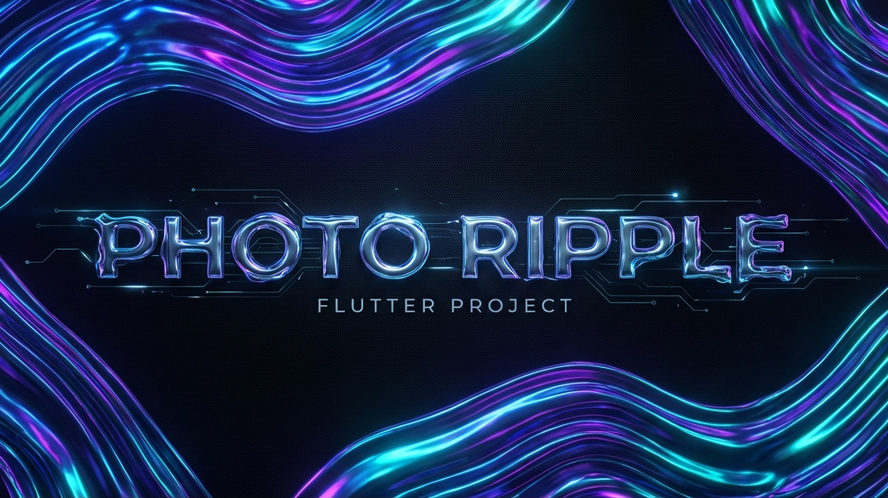
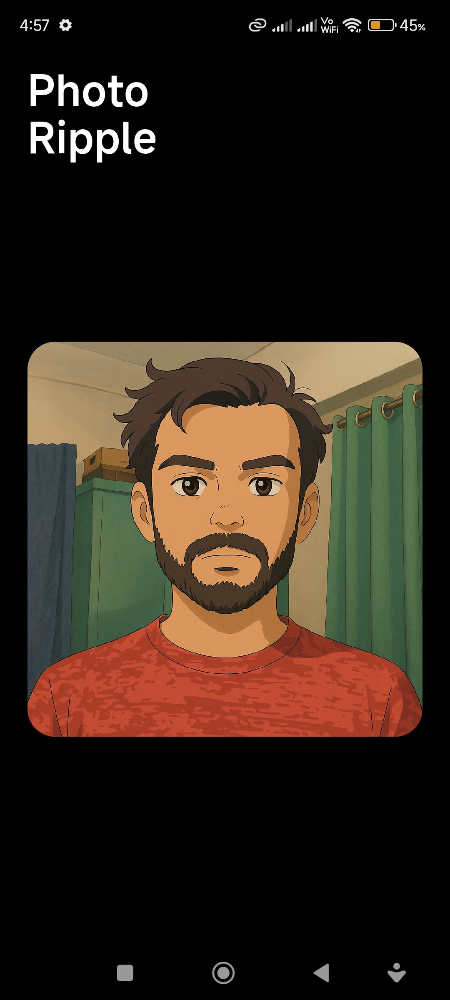
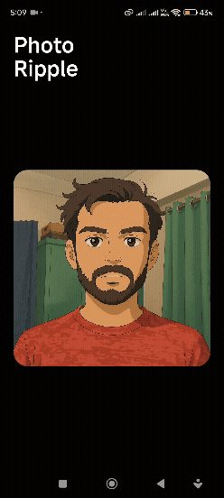

<div align="center">
  
  
  # Photo Ripple 🌊
  
  [](https://flutter.dev/)
  [](https://dart.dev/)
  []()
  [](LICENSE)
</div>

> *This project investigates how organic, liquid-style feedback can improve perceived responsiveness during touch interactions.*

---

## 🚀 Project Description

**Photo Ripple** is a high-performance Flutter application that creates mesmerizing, interactive liquid ripple effects on images. Powered by custom **GLSL shaders** (`.frag`), it implements a physics-inspired propagation model where user tap events visually simulate a liquid response. 

The project intentionally avoids third-party animation libraries to keep the motion logic transparent, lightweight, and fully controllable. Designed with a sleek, dark-themed UI, it demonstrates how low-level rendering can achieve cinematic visual effects at a stable **60fps on device**.

---

## 📸 Demo

| 📱 App Screenshot | 🎬 App Walkthrough |
|------------------|-------------------|
|  |  |

---

## 🛠️ Tech Stack & Philosophy

*   **Framework**: [Flutter](https://flutter.dev) (Dart)
*   **Rendering**: CustomPainter & Shaders (GLSL)
*   **Typography**: Inter (Google Fonts)
*   **Architecture**: Component-based UI

**Design Philosophy:**
> "The project intentionally avoids third-party animation libraries to keep motion logic transparent and controllable."

---

## ✨ Features

*   **💧 Interactive Ripple Effect**: User tap events trigger a ripple propagation model that visually simulates liquid response.
*   **⚡ High Performance**: Optimized for 60fps rendering on mobile devices using hardware-accelerated GLSL.
*   **🎨 Aesthetic UI**: Minimalist dark mode design with premium typography.
*   **👆 Multi-touch Support**: Handles rapid touches with independent wave interference.
*   **📱 Responsive**: Adapts seamless to different screen sizes and aspect ratios.

---

## ⚡ Performance
The ripple animation maintains ~60 FPS on physical devices under
standard interaction. No heavy shaders or GPU-intensive effects are used,
keeping frame rendering stable.


---

## 🔮 Future Enhancements

*   [ ] **Custom Image Picker**: Allow users to upload their own photos.
*   [ ] **Ripple Customization**: Sliders to control wave speed, frequency, and strength.
*   [ ] **Video Export**: Record and save the ripple animation as a video/GIF.
*   [ ] **Gyroscope Support**: Move the water by tilting the device.

---

## 📦 Installation

1.  **Clone the repository**:
    ```bash
    git clone https://github.com/Akarshjha03/Flutter-Ripple-Effect.git
    ```

2.  **Navigate to the project directory**:
    ```bash
    cd flutter_ripple_effect
    ```

3.  **Install dependencies**:
    ```bash
    flutter pub get
    ```

4.  **Run the app**:
    ```bash
    flutter run
    ```

---

## 🔗 Release

Download the latest release [v1.0.0](https://github.com/Akarshjha03/Flutter-Ripple-Effect/releases/tag/v1.0.0).

---

## 🧩 Usage as UI Component

You can easily use the `RipplePainter` in your own Flutter projects:

```dart
// Import the necessary files
import 'shaders/ripple.frag'; 

CustomPaint(
  painter: RipplePainter(
    program: _program!, // Your loaded FragmentProgram
    image: _image!,     // dart:ui Image
    ripples: _ripples,  // List of ripple objects
    time: _elapsedTime, // Current animation time
  ),
  size: Size(width, height),
)
```

---
